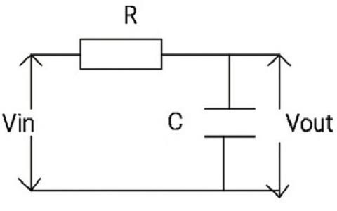
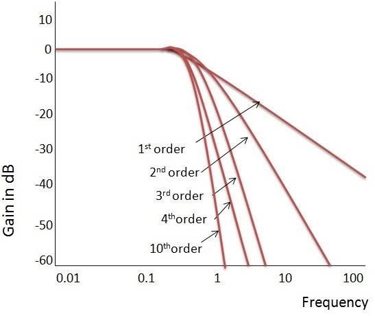
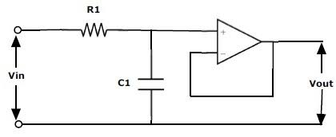
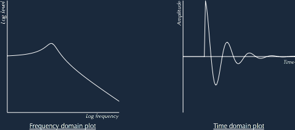

# Voltage Control Filter
Voltage Control Filter or simply VCF are widely used in music systems and music synthesizers to add a characterstic enhancement to ordinary input music. In this project, a resonant high/low pass filter is implemented which takes in some control voltage to control the cutoff frequency of the filter on the fly.

### Filter:
First things first, what is a filter and why is it used. Filters are electronic circuits. Assume we have a signal which is made up of several frequencies mixed together. Filters circuits are used to filter out or saperate out signals with certain frequency from the given signal. Based on this, filters are broadly classified as:
- Low pass filter: Allows low frequency signals to pass through
- High pass filter: Allows high frequency signals to pass through
- Band pass filter: Allows frequencies of certain range to pass through

### Low Pass Filter
With that said, let's now consider only low pass filter for now.
A simple low pass filter can be constructed as shown. It is built using a resistor and capacitor pair. Such setup is often refered as first order low pass filter.

<br>

<br>

Consider the situation where a square wave is fed to our low pass filter. Math folks in the room will know that a square wave is a mix of sine waves with many frequencies. Infact, a square wave can be approximated in Fourier Series as summation of infinite sine waves with several frequencies. So, when such signal is passed through the low pass filter, output will only contain few sine waves with low frequency. Thus, the output should look roughly like a sine wave.

It should be considered that from a low pass filter, we expect all the frequencies above certain frequency (called cutoff frequency) to be removed from the input. Such filters are ideal and have a perfect vertical line at the cutoff frequency in the frequency response graph. But such behaviour is not observed in practical filters. They have a more gradual rolloff at the cutoff frequency. While designing a filter we want the frequency response to be as close to ideal as possible or we need the rolloff to be as steep as possible. And yes, as you may expect, usually in electronics, simple circuits are far from ideal. It's also true for our simple low pass filter. It has a very gradual rollof at cutoff frequency. So, usually two of our simple low pass filters are cascaded to form a two stage filter which is helpful to improve the rollof. Such filter is called a second order filter.

<br>

<br>

### Active Low Pass Filter
The present setup does a great job in filtering out high frequencies. But since the setup is purely passive, output voltages are way too small when compared to the input since passive components cause a drop in voltage ie, gain of the system is too low.
To prevent this the circuit is converted to a active low pass filter.

### Buffer
Before moving forward, we need to understand what buffers are and how they work.
Consider an Operational Amplifier or opamp in short. These are active devices. It's helpful to think of these devices as voltage sensors. It has two terminals calles inverting(-) and non-inverting(+) inputs. When connected in some circuit, the opamp tries to calculate the voltage difference between its terminals. ie Vdif = (V+) - (V-)
then the output produced by the opamp is simply this difference scaled by some internal gain of the opamp which is usually very high. It should be noted that the terminals act just like sensors and never pull in current from the external circuit. In other words, the input resistance of the opamp is very high.
Opamps can be used in a range of applications. One of them is a Buffer. Buffer is a one input, one output device. It simply outputs a copy of input voltage at the output. Well, whats so great about it! As said earlier, opamps have a very high input resistance. So, when a load is connected to the output of the opamp, it draws current from the opamp's voltage source rather than the input directly. It's particularly useful when the input voltage is too weak and can't supply enough current demanded by the load.
Great! With that out of the way, consider the circuit connected as follows. A buffer is connected between the two stages. Such setup is enough to convert out previous circuit to active low pass which has reasonable output voltage. A single stage active low pass would look like the one in the figure.

<br>

<br>

### Resonance
The current circuit can act as a pretty good low pass filter. But we are not building a plane low pass filter. We would like to add something more to the output to achieve that characteristic enhancement produced by a many music systems. This something, my friends! is what we call the Resonance.
Ok, lets define it properly. As said before, a simple low pass will show a rollof at the cutoff frequency. But a resonant filter will enhance or amplify the frequencies near the cutoff frequency. So, in frequency response, we observe a bump at the cutoff frequency. What does this mean in time domain? The output wave would look something like the figure. It's as if the circuit "overreacts" to changes in the input signal forming a wave-ish pattern.
Theory is great and all, but how do we actually implement a circuit which does this? Luckily for us, it's as simple as connecting a feedback loop via a capacitor. Not going into details about how this setup works.But it's really helpful to analyse the in's and out's of this circuit.
Such circuit offers a fixed resonance. But it's really convenient to change the amount of resonance in the output signal on the fly. It's easy to reduce it. Just reduce the feedback or more precisely, the gain of feedback network by adding a series resistor. It should make it clear that increasing the feedback should increase the resonance. Since no one makes resistors with negative resistance, we need a more mature plan. We use an amplifier to amplify the feedback. Again, there are many ways to design an amplifier with different specs. For out needs, we can simply convert an Opamp to a proper amplifier.

<br>

<br>

Doing that should be pretty intutive. In case of buffer, output was directly connected to the inverting input of the opamp effectively creating a negative feedback loop. Connecting directly implies that the feedback we created here has unity gain, ie. output of the feedback is same as it's input. To Convert the buffer to an amplifier, we decrease the feedback gain, and since it is a negative feedback loop, output of the opamp should increase, thereby acting as an amplifier. With that in mind, to actually reduce the feedback gain, we build something called a voltage divider as shown in figure. It would be helpful to know how two resistors in series can act as a voltage divider. Additionally, we drive the input of feedback network through a potentiometer to change the feedback gain at runtime.
### Additional Stuff
With the previous circuit, we are almost done. But some additional components should be added to the circuit to make it more reliable. First, we add a voltage divider at the input of the filter to stepdown the input voltage. This is mainly done to prevent distorsion which is caused when opamps run out of their capacity to supply output voltage and settle at highest possible voltage they can give out. Next, we add a simple first order high pass filters at output and input of the entire setup. This is done to properly center the input and output voltage of the filter around zero volts. Finally, since we are building a voltage control filter, we need to control the cutoff frequency of the filter on the fly with some voltage. Cutoff frequency of out filter is determined by the combination of resistor and capacitor values used in out simple low pass filter discussed above. Since there is no obvious way to control the value of capacitor, we vary the value of resistors by replacing ordinary resistors with  voltage controlled resistor. The end circuit would look something like this.

<br>
<a href=https://www.multisim.com/content/38KkqZxKF5T4WnXEdLbwdk/vcf/ target="_blank">
	<br>
</a>
<br>

### Listening to output
Ok boring stuff aside! lets do something interesting. Since we are designing a audio filter, it would be no good to leave this here without listening to the signals we give out filter as input and output it gives us back. It can be a bit tricky with multisim. First we need to setup the circuit with some input signal, lets say a square wave. Then we will place a voltage probe at the input node to record the input signal. It's important to place only one probe in the entire circuit so that only one signal is plotted. Things completely break if you place more than one probes in the circuit. Next, we simulate(run) out circuit for some time, say for 500ms-1sec. A single voltage plot should appear in the oscilloscope.Then simply click on the top left menu and select `Export->Grapher data(csv)`. This should download a .csv file to your device. Make sure to place the csv file and the `convert.py` file of this project in the same directory and run the following.

```
python convert.py <csvFileName>.csv
```
Make sure python is installed in your machine. The above should create a new file named `rec.wav`. Any .wav running software should be able to read it and play the sound by simply double clicking it. Personally, I use the following python script.

```
from playsound import playsound
playsound('rec.wav')
```

playsound module can be installed using pip or any other python package manager

```pip install playsound```


With that my friends, you should be able to enjoy the melodious music created by your filter. Well sort of melodious ;p. Enjoy!!

<br>

Have any suggessions, improvements or doubts feel free to reach me out **[@gvictorsd](https://github.com/gvictorsd)**.

